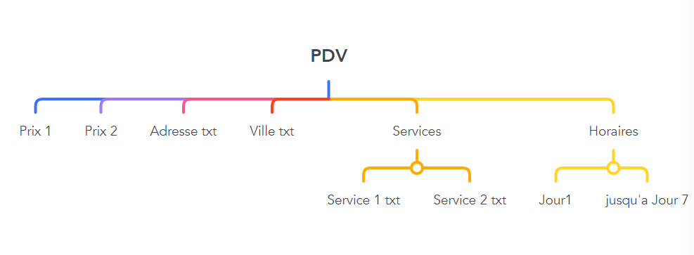

# TP1-Algo-et-Python

Ce projet consiste à explorer et analyser les données des prix des carburants sur une période allant de 2007 à 2023 en utilisant des fichiers XML provenant de différentes années.

## Données : Open Data

Les données relatives aux prix des carburants utilisées dans ce projet sont disponibles en libre accès via l'Open Data gouvernemental. Vous pouvez télécharger ces données directement à partir du site officiel :

- [Données Open Data des Prix des Carburants](https://www.prix-carburants.gouv.fr/rubrique/opendata/)

## Étape 1 : Compréhension de la Structure des Fichiers XML

Pour commencer, nous avons téléchargé le tout premier fichier des données instantanées afin de mieux comprendre la structure du fichier XML.

Nous avons réalisé que le fichier de données instantanées n'était pas approprié pour notre projet, ce qui nous a amenés à télécharger les fichiers d'archives.

## Étape 2 : Importation et Lecture du Fichier XML

Nous avons importé et lu le fichier XML en utilisant la bibliothèque `xml.etree.ElementTree` de Python.

## Étape 3 : Extraction des Informations des Noeuds des Prix

Nous nous sommes concentrés sur les noeuds (balises) des prix, car les autres noeuds tels que "Services" et "Horaires" de chaque PDV ne sont pas pertinents pour notre analyse. Nous avons extrait les informations stockées dans les noeuds des prix sous forme d'attributs au lieu de texte.

## Étape 4 : Création de Séries Temporelles

Nous avons créé deux séries temporelles distinctes, une pour le Gazole et une autre pour le SP95, en utilisant les données extraites des fichiers XML.

## Étape 5 : Boucle pour Chaque Année (2007-2023)

Nous avons répété le même processus pour chaque année de 2007 à 2023 en utilisant une boucle, en important et analysant les fichiers XML correspondants.

## Étape 6 : Concaténation des Séries Temporelles

Nous avons concaténé toutes les séries temporelles individuelles pour obtenir deux séries temporelles finales, l'une pour le Gazole et l'autre pour le SP95, couvrant la période de 2007 à 2023.

## Étape 7 : Remise à l'Échelle des Données de 2022

Pour les données de l'année 2022, nous les avons remises à l'échelle en multipliant par 1000, car pour les autres années, 1000 équivaut à 1€.

## Étape 8 : Tracé du Graphique

Nous avons tracé le graphique demandé en utilisant les séries temporelles finales, en mettant en évidence les différences entre les prix du SP95 et du Gazole.

## Utilisation

Pour exécuter ce code, assurez-vous de placer tous les fichiers XML dans un même dossier et de modifier le chemin du dossier dans la variable "fichier_xml" du code.

## Auteur

- [Bensefia Walid]
- [Hafdi Ramy]
